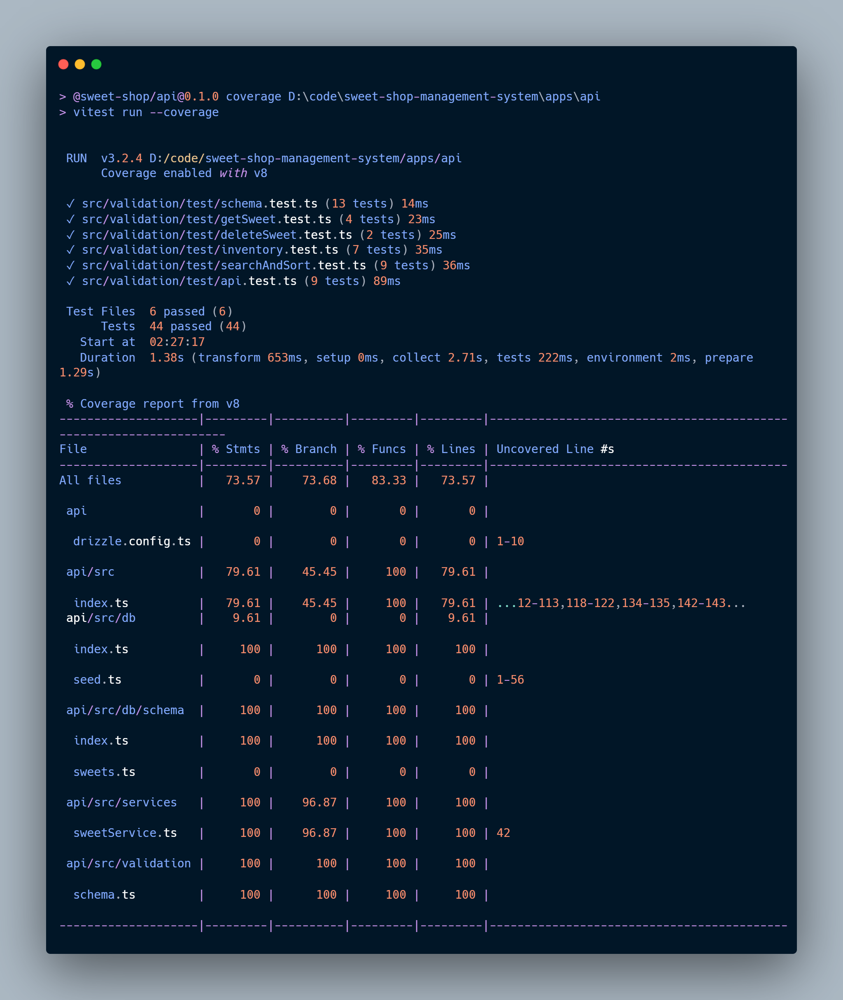
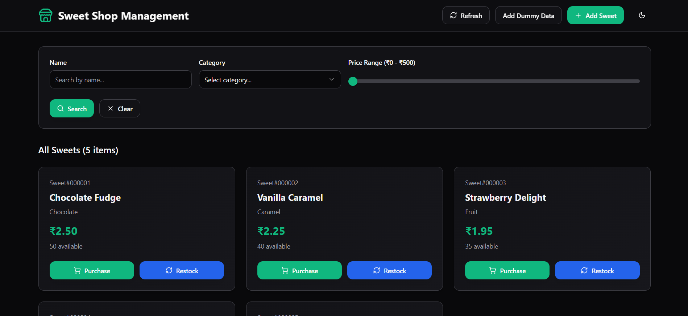
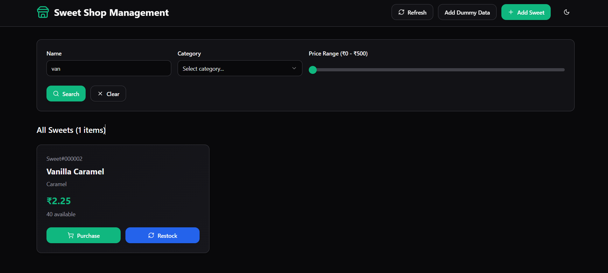
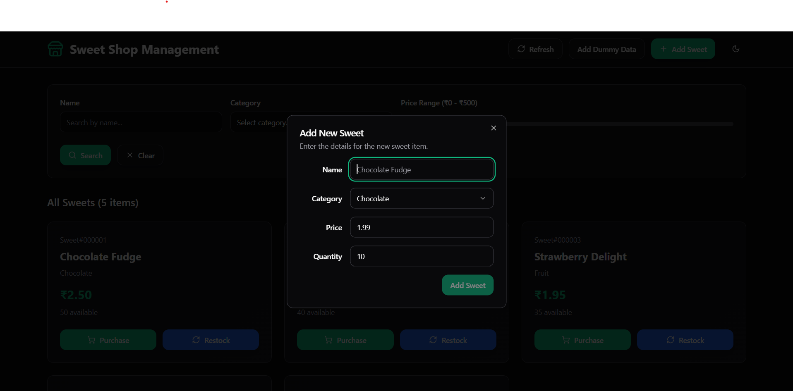
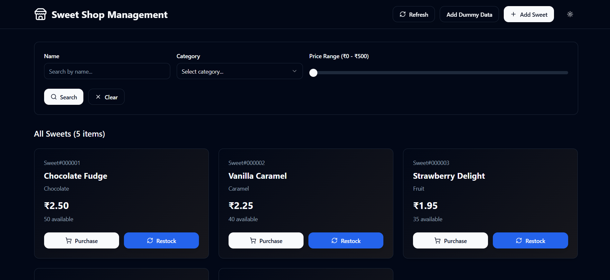

# Sweet Shop Management System

A comprehensive management system for sweet shops built as a pnpm monorepo, featuring a Hono-powered API backend with Drizzle ORM and a React frontend with Tailwind CSS.

## Project Structure

```
sweet-shop-management-system/
├── apps/                     # Frontend and backend applications
│   ├── api/                  # Hono API backend with Drizzle ORM
│   ├── sweet-shop-api-core/  # Core components shared between projects
│   └── web/                  # React frontend with Tailwind CSS
├── package.json              # Root package.json
└── pnpm-workspace.yaml       # Workspace configuration
```

## 🚀 Features

- **Inventory Management**: Add, update, delete, and track sweets in your shop
- **Search & Filter**: Find products by name, category, and price
- **Stock Management**: Purchase and restock functionality with stock tracking
- **Dark/Light Mode**: Theme switching for better user experience
- **Responsive Design**: Works on desktop and mobile devices

## Getting Started

### Prerequisites

- Node.js (>=18.0.0)
- pnpm (>=8.0.0)

### Installation

```bash
# Install dependencies for all packages
pnpm install
```

### Development

```bash
# Run development servers for all applications
pnpm -r dev

# Build all packages and applications
pnpm -r build

# Run tests across all packages and applications
pnpm -r test
```

### Accessing the Application

- **API**: http://localhost:3000/api
- **Web Frontend**: http://localhost:8080 (or http://localhost:8081 if port 8080 is in use)

## 📊 Test Reports

Below is the test coverage report for the Sweet Shop Management System:



## 📱 Application Screenshots

### Dashboard View



### Sweet Management Interface



### Adding New Sweet



### Filter and Search Functionality


